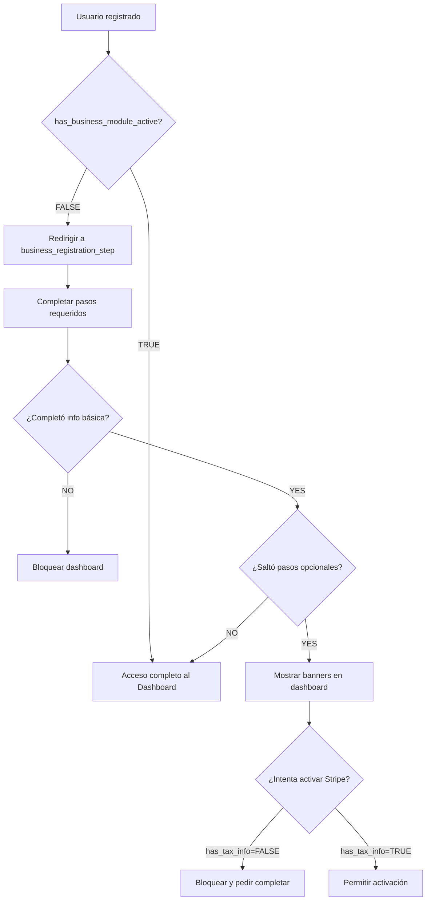

# Guía de Implementación: Sistema de Onboarding Progresivo
## Kuali Leal - SSO Ligero y Reducción de Fricción

---

## 📋 Tabla de Contenidos

1. [Resumen Ejecutivo](#resumen-ejecutivo)
2. [Arquitectura del Sistema](#arquitectura-del-sistema)
3. [Migración de Base de Datos](#migracion-de-base-de-datos)
4. [Configuración de Cookies Compartidas](#configuracion-de-cookies-compartidas)
5. [Middleware Inteligente](#middleware-inteligente)
6. [Flujo de Onboarding](#flujo-de-onboarding)
7. [Gated Features](#gated-features)
8. [Pasos de Implementación](#pasos-de-implementacion)
9. [Testing](#testing)

---

## Resumen Ejecutivo

Este sistema implementa un **Onboarding Progresivo** que maximiza el reclutamiento de negocios al:

- ✅ Reducir fricción: permitir acceso al dashboard sin completar todos los pasos
- ✅ Sesiones compartidas: SSO ligero entre `kualileal.com` y `app.kualileal.com`
- ✅ Rutas exactas: eliminar referencias genéricas como `/onboarding`
- ✅ Gated features: bloquear funciones críticas (Stripe) hasta completar datos fiscales
- ✅ Banners persuasivos: recordar pasos pendientes dentro del dashboard

---

## Arquitectura del Sistema

### Dominios

```
kualileal.com (Dominio Principal)
├── /login                    # Autenticación
├── /register                 # Registro inicial
└── /role-selection           # Paso 1: Selección de rol

app.kualileal.com (Subdominio SaaS)
├── /register/business/
│   ├── whatsapp              # Paso 2: WhatsApp
│   ├── verify-whatsapp       # Paso 3: Verificación
│   ├── info                  # Paso 4: Info básica + logo (REQUIRED)
│   ├── tax                   # Paso 5: Datos fiscales (OPTIONAL - can skip)
│   ├── locations             # Paso 6: Ubicaciones (OPTIONAL - can skip)
│   └── pricing               # Paso 7: Planes (REQUIRED)
└── /dashboard/inicio         # Dashboard principal
```

### Flujo de Estados



---

## Migración de Base de Datos

### Paso 1: Ejecutar migración SQL

```bash
# Conectar a la base de datos app01 (usuarios)
mysql -u root -p bdKualiLealApp01 < /var/www/app.kualileal.com/migrations/add_onboarding_fields.sql
```

### Campos agregados a la tabla `users`:

| Campo | Tipo | Descripción |
|-------|------|-------------|
| `business_registration_step` | VARCHAR(255) | URL del último paso completado |
| `has_basic_business_info` | BOOLEAN | TRUE cuando completa Zona C (info + logo) |
| `has_business_module_active` | BOOLEAN | TRUE cuando elige plan o hace skip |
| `has_tax_info` | BOOLEAN | TRUE cuando completa datos fiscales |
| `has_locations` | BOOLEAN | TRUE cuando completa ubicaciones |
| `onboarding_completed_at` | TIMESTAMP | Fecha de completado |
| `last_onboarding_update` | TIMESTAMP | Última modificación |

---

## Configuración de Cookies Compartidas

### Estado Actual ✅

Las cookies ya están configuradas para compartirse en `.kualileal.com`:

**Archivo:** `app.kualileal.com/src/lib/auth.ts:52`

```typescript
if (process.env.NODE_ENV === "production") {
  cookieOpts.domain = ".kualileal.com";
}
```

### Cómo funciona el SSO Ligero

1. Usuario inicia sesión en `kualileal.com`
2. Se crea cookie `kuali_session` con `domain=.kualileal.com`
3. Usuario visita `app.kualileal.com`
4. El navegador envía automáticamente la cookie
5. Middleware lee la sesión sin pedir login nuevamente

### Variables de entorno requeridas

```env
# .env
JWT_SECRET=kuali-leal-secret-key-super-secure-32-chars
NODE_ENV=production
```

---

## Middleware Inteligente

### Reemplazar middleware actual

**Ubicación:** `app.kualileal.com/src/middleware.ts`

```bash
# Hacer backup del middleware actual
mv app.kualileal.com/src/middleware.ts app.kualileal.com/src/middleware.old.ts

# Activar nuevo middleware
mv app.kualileal.com/src/middleware.new.ts app.kualileal.com/src/middleware.ts
```

### Lógica del nuevo middleware

```typescript
// 1. Usuario sin sesión → Redirige a login
if (!session && pathname.startsWith('/dashboard')) {
  redirect('https://kualileal.com/login');
}

// 2. Usuario con sesión pero onboarding incompleto → Redirige a next step
if (session && !canAccessDashboard(session)) {
  const nextStep = getNextOnboardingStep(session);
  redirect(nextStep);
}

// 3. Usuario con onboarding completo → Permite acceso
if (session && canAccessDashboard(session)) {
  return NextResponse.next();
}
```

---

## Flujo de Onboarding

### Rutas Exactas (NO CREAR GENÉRICAS)

```typescript
// ❌ PROHIBIDO
/onboarding
/onboarding/step1
/onboarding/step2

// ✅ CORRECTO (rutas exactas)
https://kualileal.com/role-selection
https://app.kualileal.com/register/business/whatsapp
https://app.kualileal.com/register/business/verify-whatsapp
https://app.kualileal.com/register/business/info
https://app.kualileal.com/register/business/tax
https://app.kualileal.com/register/business/locations
https://app.kualileal.com/register/business/pricing
```

### Ejemplo de Implementación en Página

**Archivo:** `app.kualileal.com/src/app/(auth)/register/business/tax/page.tsx`

```typescript
import { markStepComplete, skipStep } from '@/app/actions/onboarding';

export default function TaxPage() {
  const handleSubmit = async (formData) => {
    // 1. Guardar datos fiscales
    await saveBusinessTaxAction(formData);

    // 2. Marcar paso como completado
    await markStepComplete('tax');
    // Auto-redirect a /register/business/locations
  };

  const handleSkip = async () => {
    // Saltar sin marcar como completado
    await skipStep('tax');
    // Auto-redirect a /register/business/locations
  };

  return (
    <form onSubmit={handleSubmit}>
      {/* Campos del formulario */}
      <button type="submit">Guardar y Continuar</button>
      <button type="button" onClick={handleSkip}>
        Saltar por el momento
      </button>
    </form>
  );
}
```

### Actualizar Estado Manualmente

```typescript
import { updateOnboardingState } from '@/lib/onboarding';

// Cuando el usuario completa el paso de info básica
await updateOnboardingState({
  userId: session.userId,
  step: 'https://app.kualileal.com/register/business/info',
  has_basic_business_info: true,
});

// Cuando el usuario elige un plan
await updateOnboardingState({
  userId: session.userId,
  step: 'https://app.kualileal.com/register/business/pricing',
  has_business_module_active: true,
});
```

---

## Gated Features

### Implementación en Dashboard

**Archivo:** `app.kualileal.com/src/app/(dashboard)/dashboard/layout.tsx`

```typescript
import { getOnboardingState } from '@/lib/onboarding';
import OnboardingBanner from '@/components/dashboard/OnboardingBanner';

export default async function DashboardLayout({ children }) {
  const session = await getSession();
  const onboardingState = await getOnboardingState(session.userId);

  const missingTax = !onboardingState?.has_tax_info;
  const missingLocations = !onboardingState?.has_locations;

  return (
    <div>
      {/* Banner persuasivo */}
      <OnboardingBanner
        missingTax={missingTax}
        missingLocations={missingLocations}
      />

      {children}
    </div>
  );
}
```

### Bloquear Activación de Stripe

**Archivo:** `app.kualileal.com/src/app/(dashboard)/dashboard/pagos/page.tsx`

```typescript
import { getSession } from '@/lib/auth';
import { getOnboardingState, needsCriticalInfo } from '@/lib/onboarding';
import { GatedFeatureNotice } from '@/components/dashboard/OnboardingBanner';

export default async function PagosPage() {
  const session = await getSession();
  const state = await getOnboardingState(session.userId);
  const criticalInfo = needsCriticalInfo(state);

  if (criticalInfo.blocksPayments) {
    return <GatedFeatureNotice feature="payments" />;
  }

  return (
    <div>
      {/* Configuración de Stripe */}
    </div>
  );
}
```

---

## Pasos de Implementación

### Fase 1: Base de Datos ✅

```bash
# 1. Ejecutar migración
mysql -u root -p bdKualiLealApp01 < migrations/add_onboarding_fields.sql

# 2. Verificar campos
mysql -u root -p bdKualiLealApp01 -e "DESCRIBE users"
```

### Fase 2: Actualizar Tipos ✅

Los archivos de tipos ya están creados:
- ✅ `src/lib/auth.ts` (SessionPayload extendido)
- ✅ `src/types/onboarding.ts` (tipos y helpers)

### Fase 3: Reemplazar Middleware

```bash
# Hacer backup
cp src/middleware.ts src/middleware.backup.ts

# Activar nuevo middleware
cp src/middleware.new.ts src/middleware.ts

# Rebuild
npm run build
pm2 restart app-kualileal
```

### Fase 4: Actualizar Páginas de Onboarding

Para cada página del flujo:

1. **Importar acciones:**
```typescript
import { markStepComplete, skipStep } from '@/app/actions/onboarding';
```

2. **Al enviar formulario:**
```typescript
await markStepComplete('step-name');
```

3. **Para pasos opcionales (tax, locations):**
```typescript
<button onClick={() => skipStep('tax')}>
  Saltar por el momento
</button>
```

### Fase 5: Agregar Banners al Dashboard

```bash
# Reemplazar layout del dashboard
cp src/app/(dashboard)/dashboard/layout.new.tsx \
   src/app/(dashboard)/dashboard/layout.tsx
```

### Fase 6: Rebuild y Deploy

```bash
cd /var/www/app.kualileal.com
npm run build
pm2 restart app-kualileal
pm2 logs app-kualileal --lines 50
```

---

## Testing

### Test 1: Session Sharing

```bash
# 1. Login en kualileal.com
# 2. Abrir DevTools → Application → Cookies
# 3. Verificar que "kuali_session" tiene domain=".kualileal.com"
# 4. Navegar a app.kualileal.com
# 5. Verificar que NO pide login nuevamente
```

### Test 2: Flujo de Onboarding Incompleto

```sql
-- Crear usuario de prueba con onboarding incompleto
UPDATE users
SET
  business_registration_step = 'https://app.kualileal.com/register/business/info',
  has_basic_business_info = true,
  has_business_module_active = false
WHERE emailUser = 'test@example.com';
```

```bash
# 1. Login con test@example.com
# 2. Intentar acceder a /dashboard/inicio
# 3. Debe redirigir a /register/business/tax
```

### Test 3: Skip Step

```bash
# 1. Navegar a /register/business/tax
# 2. Click en "Saltar por el momento"
# 3. Verificar redirección a /register/business/locations
# 4. Verificar en DB que has_tax_info = FALSE
```

### Test 4: Gated Feature

```sql
-- Usuario sin datos fiscales
UPDATE users
SET
  has_business_module_active = true,
  has_tax_info = false
WHERE emailUser = 'test@example.com';
```

```bash
# 1. Login como test@example.com
# 2. Navegar a /dashboard/pagos
# 3. Debe mostrar GatedFeatureNotice
# 4. Banner debe aparecer en todas las páginas del dashboard
```

### Test 5: Onboarding Completo

```sql
UPDATE users
SET
  has_business_module_active = true,
  has_basic_business_info = true,
  has_tax_info = true,
  has_locations = true,
  onboarding_completed_at = NOW()
WHERE emailUser = 'test@example.com';
```

```bash
# 1. Login como test@example.com
# 2. Debe redirigir directamente a /dashboard/inicio
# 3. NO debe mostrar banners de onboarding
```

---

## Troubleshooting

### Problema: Cookies no se comparten

**Solución:**
```typescript
// Verificar en src/lib/auth.ts
if (process.env.NODE_ENV === "production") {
  cookieOpts.domain = ".kualileal.com"; // ← Debe tener el punto inicial
}
```

### Problema: Redirección infinita

**Solución:**
```typescript
// En middleware.ts, asegurar que no se redirija a la misma ruta
const nextStep = getNextOnboardingStep(session);
if (nextStep && nextStep !== request.url) {
  redirect(nextStep);
}
```

### Problema: Session no se actualiza

**Solución:**
```typescript
// Llamar updateSession después de updateOnboardingState
await updateOnboardingState({ userId, has_tax_info: true });
await updateSession({ has_tax_info: true });
```

---

## Checklist de Implementación

- [ ] Migración de base de datos ejecutada
- [ ] Cookies configuradas con `.kualileal.com`
- [ ] Middleware reemplazado y testeado
- [ ] Páginas de onboarding actualizadas con `markStepComplete`
- [ ] Botones "Skip" implementados en tax y locations
- [ ] Banners agregados al dashboard layout
- [ ] Gated features implementados (Stripe)
- [ ] Tests de sesión compartida pasados
- [ ] Tests de flujo de onboarding pasados
- [ ] Deploy en producción realizado
- [ ] Monitoreo de logs activado

---

## Recursos Adicionales

### Archivos Clave

```
/var/www/app.kualileal.com/
├── migrations/add_onboarding_fields.sql
├── src/types/onboarding.ts
├── src/lib/onboarding.ts
├── src/app/actions/onboarding.ts
├── src/middleware.ts (NUEVO)
├── src/components/dashboard/OnboardingBanner.tsx
├── src/components/onboarding/OnboardingLayout.tsx
└── src/hooks/useOnboarding.ts
```

### Comandos Útiles

```bash
# Ver logs en tiempo real
pm2 logs app-kualileal --lines 100

# Rebuild y restart
npm run build && pm2 restart app-kualileal

# Verificar estado de cookies en producción
curl -I https://app.kualileal.com/dashboard/inicio

# Consultar estado de onboarding en DB
mysql -u root -p -e "
  SELECT
    emailUser,
    business_registration_step,
    has_basic_business_info,
    has_business_module_active,
    has_tax_info,
    has_locations
  FROM bdKualiLealApp01.users
  WHERE role = 'BUSINESS_OWNER'
  LIMIT 10
"
```

---

## Contacto y Soporte

Para preguntas sobre esta implementación:
- **Documentación técnica:** Este archivo
- **Arquitectura:** Ver diagrama en sección "Arquitectura del Sistema"
- **Issues:** Reportar en repositorio del proyecto

---

**Generado por Claude Code**
Fecha: 2026-03-27
